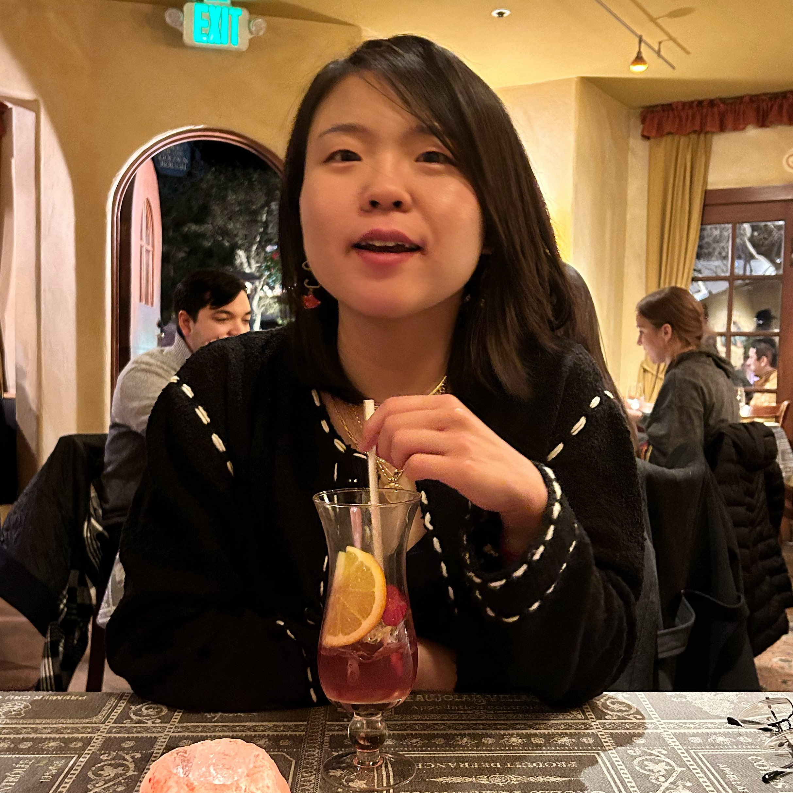
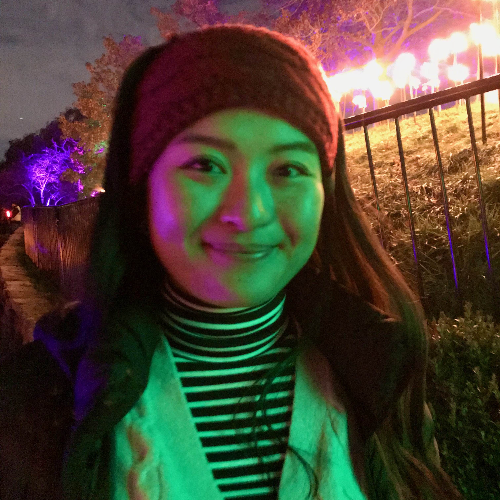
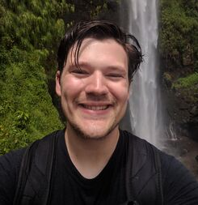

# Welcome!

This is the website for the Biostatistics and Data Science Workshop, organized by Division of Biostatistics at the University of California, Berkeley.

# About the Workshop

### Background

Historically underrepresented minority (URM) students often face significant obstacles in accessing equitable educational opportunities, particularly in the fields of Science, Technology, Engineering, and Mathematics (STEM). These challenges are most pronounced during the early stages of their education, notably in high school and at the start of their undergraduate studies. Early exposure to STEM disciplines, including programming and data analysis, is critical for these students as it not only provides the necessary skills and experiences for advanced research or graduate studies but also opens up new potential career paths.

With this in mind, the long-term goal of our Biostatistics Workshop is to offer URM students an opportunity for equitable exposure to programming and data analysis. By doing so, we aim to showcase how data science and biostatistics can be both engaging and valuable as potential career options. Importantly, this workshop is dedicated to addressing educational inequality, rather than simply increasing the number of URM applicants in our department.

### Workshop Overview

This two-day workshop provides an immersive experience in basic data analysis using R, a popular programming language in data science. Participants will engage in data cleaning, preprocessing, and visualization tasks, with a special emphasis on datasets relevant to public health and biomedical fields.

In addition, the workshop provides:

**Research Exposure**: Participants will hear from faculty members and graduate students from the Biostatistics department at UC Berkeley, who will share insights into their groundbreaking research. Short seminars on soft skill development may also be included.

**Project Experience**: Following the initial sessions, participants are invited to spend an extra day working on mini-projects involving real-world data, and presenting their project proposals to their peers.

**Networking Opportunities**: Informal networking sessions will offer the chance for participants to connect with peers, graduate students, and faculty members over food and drinks.

### Learning Objectives

Upon completion of the workshop, participants will:

- Develop basic skills in programming and data analysis.
- Gain practical experience in processing, analyzing, and visualizing data.
- Understand the daily tasks of a research scientist or data analyst to envision potential career paths.
- Explore interesting challenges and projects in public health and biomedical fields.
- Network with peers and faculty, potentially forging lifelong professional connections and friendships.

# Instructor Team {.tabset .tabset-fade .tabset-pills}

## Yutong Wang

::: profile-pic

:::

Yutong is a PhD candidate in Biostatistics at UC Berkeley. She is also the Diversity, Equity, Inclusion, and Belonging (DEIB) Student Fellow in Biostatistics. Yutong uses statistics and computer science to investigate how genetics affect human health, such as cancer biology and neuroscience. When not staring at her computer, Yutong loves climbing, hiking, reading, and baking.

## Kaitlyn Lee

::: profile-pic

:::

Kaitlyn (she/her) is a 1st year MA/PhD student in Biostatistics at UC Berkeley. She studies ways to quantify how different policies cause an outcome to change (for example, how lowering the speed limit on a street might change the number of car crashes). Outside of school and research, she likes going on runs with her dog, trying new ice cream flavors, and working on crossword puzzles. She's very excited to be a part of this workshop this weekend!

## Max Murphy

::: profile-pic

:::

Max is a 4th year PhD student in the Department of Biostatistics at UC Berkeley. He works on analyzing the genetics of Malaria parasites, developing methods to understand how the parasite spreads through populations. When he's not working, you can find him playing and hiking with his dog Charlie, or playing video games with his brothers and partner.

# Schedule

## Day 1: Introduction to R and RStudio

| Time             | Activity                                                                                                  |
|----------------------|-------------------------------------------------|
| 9 - 9:30 AM      | [Welcome and introduction](https://docs.google.com/presentation/d/1ubmW3tSswlPLCWKNndFRzxaO2RpYvOn8GHcgLclTNcI/edit?usp=sharing)                                                                                  |
| 9:30 - 10:30 AM  | Lecture: [Introduction to data science and data analysis](https://docs.google.com/presentation/d/1BuW9tqQuQ15R2IFkdrAfHT1hwKxKO5ypF_XS7CSen64/edit?usp=sharing) |
| 10:30 - 10:45 AM | Forming groups and Q&A                                                                                    |
| 10:45 AM - 12 PM | Campus Tour                                                                                               |
| 12 - 1 PM        | Lunch Break                                                                                               |
| 1 - 3 PM         | R workshop ([Introduction to R and `learnr`](https://biostat-workshop-s23.fly.dev/intro-r/){target="_blank"})                                                               |

## Day 2: Data Wrangling and Visualization

| Time                | Activity                                     |
|---------------------|----------------------------------------------|
| 9 - 10 AM           | Faculty Panel                                |
| 10 - 11 AM          | Graduate Student Panel                       |
| 11 - 11:15 AM       | Break                                        |
| 11:15 AM - 12:45 PM | R workshop ([Star Wars Data Wrangling](https://biostat-workshop-s23.fly.dev/star-wars/){target="_blank"})        |
| 12:45 - 1:15 PM     | Lunch Break                                  |
| 1:15 - 2:15 PM      | R workshop ([Penguins and Data Visualization](https://biostat-workshop-s23.fly.dev/penguins/){target="_blank"}) |
| 2:15 - 3 PM         | Brainstorming and Creativity                 |

# Resources

## Labs

-   [Introduction to R and `learnr`](https://biostat-workshop-s23.fly.dev/intro-r/){target="_blank"}
-   [Star Wars Data Wrangling](https://biostat-workshop-s23.fly.dev/star-wars/){target="_blank"}
-   [Penguins and Data Visualization](https://biostat-workshop-s23.fly.dev/penguins/){target="_blank"}
-   [Berkeley Admissions and the Simpson's Paradox](https://biostat-workshop-s23.fly.dev/berkeley-admissions/){target="_blank"}

## Extra Resources

If you are interested in learning more about R and RStudio on your own, here are some resources that we recommend:

-   [R for Data Science](https://r4ds.hadley.nz/) by Hadley Wickham and Garrett Grolemund
-   [RStudio Cheat Sheets](https://rstudio.com/resources/cheatsheets/)

If you are interested in finding data to explore, here are some resources that we recommend:

-   [U.S. Government Open Data](https://www.data.gov/)
-   [Kaggle Datasets](https://www.kaggle.com/datasets)

# Acknowledgement

We extend our gratitude to the instructor team - Yutong Wang, Kaitlyn Lee, and Maxwell Murphy, for their substantial contributions to outreach, recruitment, coordination, and instructional material development. Special thanks to Corinne Riddell, our DEI Faculty advisor, for her pivotal guidance, and to Juan Alberdin, Christina Da Silva, and Burke Bundy for their administrative and technical support.

We appreciate the support of Alan Hubbard, Chair of the Biostatistics Division, for facilitating necessary funding. We also acknowledge the financial assistance from the Blue Shield of California Health Equity Fellows Program, which significantly contributed to the implementation of the workshop.

We are grateful to our faculty panel - Jingshen Wang, Linqing Wei, and Zeyu Zheng, and graduate student panel - Noel Pimentel, Nolan Gunter, and Lauren Liao, for their valuable insights. Acknowledgements are also due to Stacy Li, Zhiyue Hu, and Jonathan Kramer-Roach for their assistance in outreach and planning, and to LPS Richmond and Oakland Technical High School for their cooperation. These collective efforts have made the workshop a valuable experience for all participants.

# Contact Us

If you have any questions, please feel free to reach out to us at [biostat-outreach\@berkeley.edu](mailto:biostat-outreach@berkeley.edu).

