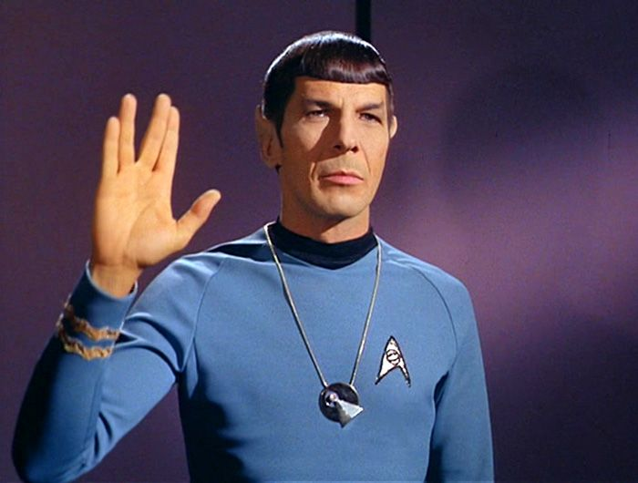

```{r setup, include=FALSE}
library(learnr) 
# devtools::install_github("rstudio-education/dsbox")
library(dsbox)
library(tidyverse)
library(scales) # plot labeling

tutorial_options(
  exercise.timelimit = 60,
  # A simple checker function that just returns the message in the check chunk
  exercise.checker = function(check_code, ...) {
    list(
      message = eval(parse(text = check_code)),
      correct = logical(0),
      type = "info",
      location = "append"
    )
  }
)
knitr::opts_chunk$set(error = TRUE)
```

## Welcome

In this tutorial, we will explore a dataset about Starwars characters, have fun 
with numbers, and learn how to answer questions from data. 


The tutorial is based on [_datasciencebox.org_](https://github.com/rstudio-education/datascience-box/blob/main/course-materials/application-exercises/ae-03-starwars-dataviz/starwars.qmd).

```{r fig, echo=FALSE, fig.cap="Live long and prosper.", out.width = '80%'}


# 
# *Live long and prosper.*
```

## Star Wars data

The data format is a table with 87 rows and 14 columns. Each row corresponds to 
a character in Star Wars, and each column represents a variable for each character. 

> Recap: 
What can be counted as a variable? 
What does each of the following variable belong to?
What are their data types? 

The variables include 

* name: name of the character
* height: height (cm)
* mass: weight (kg)
* hair_color, skin_color, eye_color: hair, skin, and eye colors
* birth_year: year born (BBY = Before Battle of Yavin)
* sex: the biological sex of the character, namely male, female, hermaphroditic, 
or none (as in the case for Droids)
* gender: the gender role or gender identity of the character as determined by their personality or the way they were programmed (as in the case for Droids)
* homeworld: the name of homeworld
* species: the name of species
* films: a list of films the character appeared in
* vehicles: a list of vehicles the character has piloted
* starships: a list of starships the character has piloted

Reference: [dplyr.tidyverse.org](https://dplyr.tidyverse.org/reference/starwars.html)

```{r data1, exercise = TRUE, exercise.eval = FALSE}
# Specify the number of characters you'd like to look at
head(starwars, n = _)
```

`head()` lets you take a quick look at the first part of a data-storing 
object. We can specify how many rows we'd like to see through the argument `n`. 

We will ask and answer some questions about the characters. Feel free to make a 
guess or say out the answer before digging into the data. :)

## Who is the tallest character in Star Wars?

```{r tall0, exercise = TRUE, exercise.eval = FALSE}
which.max(starwars$height)
```

`which.max` determines the location, i.e., index of the (first) maximum of a 
numeric vector. Once we know the location of the tallest chatacter, we can find 
their name of that specific location. 

```{r tall1, exercise = TRUE, exercise.eval = FALSE}
starwars[which.max(starwars$height), "name"]
```

We could also look a bit more into the heights (numerical values) of all the 
chatacters in Star Wars. 

```{r tall2, exercise = TRUE, exercise.eval = FALSE}
summary(starwars$height)
```

`summary` gives summary statistics of many numbers. In statistics, given many 
data points, we can divide the number of data points into four parts. 

- The smallest number (minimal or `Min.`) is the minimum of the data points. 

- The first quartile (`1st Qu.`) is defined as the middle number between the 
smallest number and the median of the data points. $25\%$ of the data are smaller 
than this number. 

- The second quartile is the `Median` of the data points. $50\%$ of the data are 
smaller than this number.

- The third quartile (`3rd Qu.`) is the middle value between the median and the 
highest value of the data points. $75\%$ of the data are smaller 
than this number. 

- The largest number (maximum or `Max.`) is the maximum of the data points. 

- In R, missing values are represented by the symbol `NA` (not available). `NA's` 
tells us the number of missing values. 

```{r tall3, exercise = TRUE, exercise.eval = FALSE}
plot(hist(starwars$height))
```

`hist` computes a histogram of the given data values. A histogram is a graph that 
shows the distribution of numeric values. 

## Who has pink eyes in Star Wars? 

```{r pink1, exercise = TRUE, exercise.eval = FALSE}
which(starwars$eye_color == "pink")
```

```{r pink2, exercise = TRUE, exercise.eval = FALSE}
starwars[which(starwars$eye_color == "pink"), "name"]
```

What is the skin color of the person with pink eyes?
```{r pink3, exercise = TRUE, exercise.eval = FALSE}
starwars[which(starwars$eye_color == "pink"), "skin_color"]
```

How many eye colors are there among all the Star War characters?
```{r pink4, exercise = TRUE, exercise.eval = FALSE}
unique(starwars$eye_color)
```

`unique` returns all the unique elements of a vector. 

```{r pink5, exercise = TRUE, exercise.eval = FALSE}
length(unique(starwars$eye_color))
```

`length` returns the length of a vector. 

How many characters are there with each specific eye color?
```{r pink6, exercise = TRUE, exercise.eval = FALSE}
table(starwars$eye_color)
```

Can you figure out how many species there are in total?
```{r pink7, exercise = TRUE, exercise.eval = FALSE}
length(unique(starwars$___))
```

## Make plots

Look at the relationship between the height and weight of each character. 

```{r plot1, exercise = TRUE, exercise.eval = FALSE}
ggplot(starwars) +
  geom_point(aes(x = height, y = mass, color = gender)) +
  theme_classic() + theme(legend.position = "bottom")
```

Can you modify the plot to include the unit for height and weight on both the x and y axis? 
```{r plot2, exercise = TRUE, exercise.eval = FALSE}
ggplot(starwars) +
  geom_point(aes(x = height, y = mass, color = gender)) +
  xlab("___") +
  ylab("___") + 
  theme_classic() + theme(legend.position = "bottom")
```

Modify the plot above to look at the relationship between height and birth year of each character. 

```{r plot3, exercise = TRUE, exercise.eval = FALSE}
ggplot(starwars) +
  geom_point(aes(x = height, y = ___, color = gender)) +
  theme_classic() + theme(legend.position = "bottom")
```

## Other questions

Try to raise other questions about the characters, and see if you could figure out the answers by playing around with the rich dataset! :)

```{r open, exercise = TRUE, exercise.eval = FALSE}
# try it out! 
```


